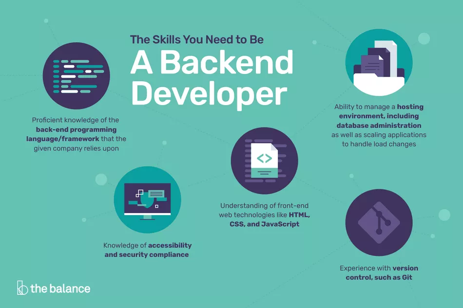
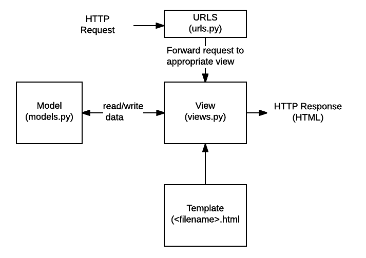

# Web Dev (LS 2020) Week 5: Introduction to Back-End Development with Django

Hey everyone,

We hope that you have enjoyed the course till now and are looking forward to venturing further into Web Development. Your assignments in the last week have really impressed us; we anticipate the same level of enthusiasm and dedication to the course as we move forward.

This week we'll be starting with the back end part of Web Development, through the use of the software framework __Django__. The framework is majorly based on __Python__, so a brief overview would be required to start with it. 

If you already know the basics of Python, dive right in to the Django tutorials. Even if you don't know Python or just aren't comfortable with it, we have some great resourses for you to build a working base of Python. Learning Python is an absolutely essential skill as its applications go far beyond just web development. Be it Game Development or Machine Learning, you need to learn Python. So we recommend giving a sufficient amount of time in understanding the fundamentals of Python and you are good to go!

Link for brief tutorials on:
 - [Python](./supplements/Python.md)
 - [pip](./supplements/pip.md)
 - [virtualenv](./supplements/virtualenv.md)

## What is Back-End Development and how does it fit in to the big picture?

Front end development involves what a user sees on the screen when they open a specific URL owned by you. Even in a completely static environment (with only HTML/CSS), when someone opens a website, some server on the planet needs to respond to you with those HTML and CSS files.

That server is just a computer, just like the one you use yourself to browse the internet. But it has been tuned for performance, and doesn't have unnecessary components like a mouse or keyboard attached. And it sits with tons of other computers probably in a data warehouse.

Programming those computers in some special way is called __Back End Development__.

Back-end developers work hand-in-hand with front-end developers by providing the outward facing web application elements server-side logic. In other words, back-end developers create the logic to make the web app function properly, and they accomplish this through the use of server-side scripting languages like Ruby or PHP.

Aside from making web applications functional, back-end developers are also responsible for optimizing the application for speed and efficiency. Moreover, back-end developers often create a data storage solution with a database, which is a crucial component for all web applications since it stores information (like users, comments, posts, etc.). Common databases include MySQL, MongoDB, and PostgreSQL.

## Developing Back-End with Django

Now that we know the role of Back-end, let's get on with designing your own Back-end with Django.

### What is Django?

Django is a high-level Python Web framework that encourages rapid development and clean, pragmatic design. Built by experienced developers, it takes care of much of the hassle of Web development, so you can focus on writing your app without needing to reinvent the wheel. It’s free and open source.

### Installing Django

We assume you have Python up and running to begin with. If not, take a look at the supplementary article on Python.

Here is an extract of the installation guide from the official website.

#### Installing an official release with pip

This is the recommended way to install Django.

1. Install [pip](https://pip.pypa.io/). The easiest is to use the [standalone pip installer](https://pip.pypa.io/en/latest/installing/#installing-with-get-pip-py). If your distribution already has pip installed, you might need to update it if it’s outdated. If it’s outdated, you’ll know because installation won’t work.

2. Take a look at [venv](https://docs.python.org/3/tutorial/venv.html). This tool provides isolated Python environments, which are more practical than installing packages systemwide. It also allows installing packages without administrator privileges. The [contributing tutorial](https://docs.djangoproject.com/en/3.0/intro/contributing/) walks through how to create a virtual environment.

3. After you’ve created and activated a virtual environment, enter the command: `$ python -m pip install Django` 

Also checkout this [video](https://youtu.be/N5vscPTWKOk) if you are facing trouble with virtual environments, through virtualenv

Here is a [video](https://youtu.be/UmljXZIypDc?list=PL-osiE80TeTtoQCKZ03TU5fNfx2UY6U4p&t=232) for Django introduction and installation through pip.

### Getting Started with Django

Once Django is up and running, its time to get your hands dirty with some code.

Checkout these articles for learning the basics of Django:
 - [Introduction to Django (Grundy, WnCC)](https://www.wncc-iitb.org/wiki/index.php/Django)

This [link](https://www.wncc-iitb.org/wiki/index.php/The_Django_Logic) will give you a birds eye view of the overall Logic behind coding Django. For detailed content and hands-on application development, continue with the text and video tutorials below.

The image below depicts how the basic flow of data in Django occurs. Use this as a mental map while designing the back-end, following the tutorials below.

We'll be using the learning by implementation approach, so that you can build something as you continue to learn. So, take a look at these [tutorials](https://docs.djangoproject.com/en/3.0/intro/tutorial01/), wherein you'll be building a basic poll application. Visit all the 7 parts of the tutorial to get your poll site ready to deploy.

Alternatively, we recommend a [YouTube Playlist](https://www.youtube.com/playlist?list=PL-osiE80TeTtoQCKZ03TU5fNfx2UY6U4p) that guides through making a basic blog application with Django. 

__Note__: We require that you only go through either text or video tutorials for the creating the application. Both cover more-or-less the same amount of content. There is no need to go through both.

##

As always, we encourage healthy discussion on our [Telegram Group](https://t.me/joinchat/SOmrORRVjQmyIpCeUd-OYw)

If you haven't already, join the [Announcements Channel](https://t.me/joinchat/AAAAAEM1ff5yT_ipGJ1pNw) for the latest updates on this course.

Next week we shall continue with advanced tutorials on Django, in this course on [Web Development](https://github.com/wncc/learners-space/tree/master/Web%20Development) from [Learners' Space](https://gymkhana.iitb.ac.in/~ugacademics/learnerspace_2020/index.php) by WnCC and Career Cell.

Created with :heart: by <a href="https://www.wncc-iitb.org/">WnCC</a>
